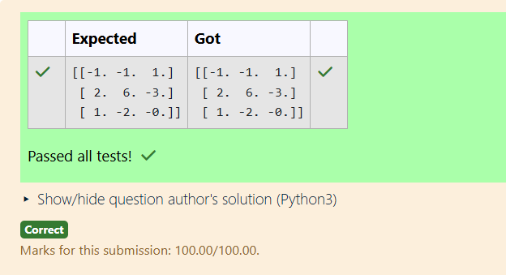

# INVERSE-OF-A-MATRIX
## Aim:
To write a python program to find the inverse of a matrix
## Equipment’s required:
1. 	Hardware – PCs
2. 	Anaconda – Python 3.7 Installation / Moodle-Code Runner
## Algorithm:
### Step 1:  
Import the necessary library, numpy, for matrix operations.  

### Step 2:  
Define the given matrix using the numpy.array() method.  

### Step 3:  
Use the numpy.linalg.inv() function to calculate the inverse of the matrix.  

### Step 4:  
Display the result using the print() function.

## Program:
```python
#Program to find the inverse of a matrix.
#Developed by: T.Manikandan
#RegisterNumber:212224110037
import numpy as np
A=np.array([[6,2,3],[3,1,1],[10,3,4]])
result=np.linalg.inv(A)
print(result)
```
## Output:

## Result:
Thus the inverse of given matrix is successfully solved using python program

